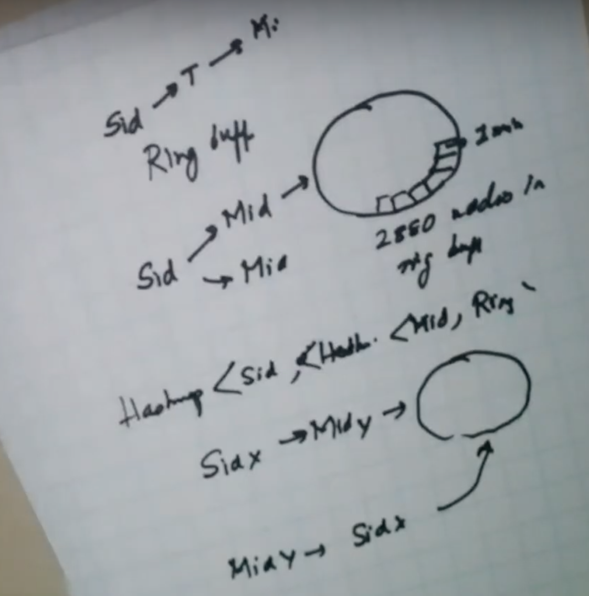

# Stream processing
- What is difference between simple key/value pair and stream?
    - Lot of data is continuously coming
    - Analytics run on window of data
    - Doesn't run on full data
    - For eg, iOT devices pump lot of data to central location
    - Central location will do sliding window processing
    - Best example is application health monitoring 
    - AWS offices have big monitors to show realtime status of different cluster
# Step1:
## a. Functional requirement
Imagine a data center having thousands(1000) of servers, each emitting thousands (2000) of metric per seconds (Such as CPU, memory, disk utilizations).

We need to build a system that serves a dashboard
-  Given a server id, return min, max, avg  of all metrics within a time window of 2 days (at a granularity of 1 min). 
- Given a metric id, return min, max, avg of all servers withing a time window of 2 days (at a granularity of 1 min)
- Given a server id and time range, return min, max, avg of all metrics
- Given a metric id and time range, return min, max and avg of all servers
## b. Collect design constraints
Data will live for 5 years
# Step2
## a. Bucketize functional requirements into micro services
There are two micro services.
### Data collection - Pub/Sub
- These servers are generating at certain pace
- Consumer is consuming at slower pace compare to producer
- Servers will generates burst of data
- Therefore you need pub/sub 
- Kafka/RabbitMQ are example to solve Pub/Sub
### Data aggregations and API Service
- Web Server tier
- In memory tier - has same logic and data model but organization of data will different compare to data stored in storage tier (2 days)
- Storage tier (1 year)
## b. Get clarity weather problem is breadth-oriented or depth-oriented

# Step3
## a. Draw a logical diagram
- Web Server tier
- In memory tier (2 days of ttl) - Web server will use cache data to run query.
- Storage tier (1 year)

Q. Why do you need pub/sub?
1. System that is collecting data and doing storage and serving this API; does more work than the system that is generating the data.
2. There is mismatch in fidelity between generator and consumer
3. It's not one to one
4. It acts as a broker
5. It takes a brust of event and consumer take as per it's own rate.
That's why you need a publisher subscriber.
## b. Draw and explain data/logic flow between them
 

# Step 4:
## Deep dive on each micro services at a time: Draw and explain data/logic flow between them
- What is each event look like?
    - [serverId, metricId, Timestamp, value]
    - Here key is [serverId, metricId, Timestamp]: value
    - Running aggregating on 1 minute of window to get following 
        [serverId, metricId, TimestampMin] : {min, max, avg}
    - Once 1min is over, data will not change
    - It helps to reduce storage by 60x
    - But multi key will not work
### Algorithm
    - We have to manage two hashmap of hashmap to support query based on serverId or metricId
    - Choose hashmap as index prefix
        1. [serverId]: [Timestamp]: [List of metric id]
        2. [metricId]: [Timestamp]: [List of server id]
    - How to handle deleting old value?
    - Use double ended queue
    - Use ring buffer i.e. circular queue
    - Ring buffer will hold timestamp of 1 minute
    - There will be 2 days worth of timestamp in ring buffer (2880 nodes)
    - This ring is size bound; so TTL of data will be handled.
    - Memory bound data structure, no chance of memory leak
    - Maintain two hashmap of hasmap and both will point to same buffer queue
    - Whenever you have requirement of fix window and data is coming in and out, ring buffer is helpful
    - It also helps to handle TTL
    - It also helps to implement time series data

    
https://leetcode.com/problems/design-circular-queue/
https://leetcode.com/problems/sliding-window-maximum/
https://leetcode.com/problems/lru-cache/

## b. Each micro services consists of one of more tiers
### Storage
- Either store data as file
- Or store data as row oriented key/value
- Or store data as colum oriented key/value
Since our data is structured therefore will use key/value store. 

Q. Should we be using row oriented or column oriented data structure?
- If the structure of data is not large 
- Column oriented helps when there are lot of columns and we are only interested on few columns
`select * from table where serverId-''`
- Row oriented is useful with heavy writes. 
- Colum oriented used for analytics
Conclusion: We will be using row oriented data structure. 

[sid, mid, Tmin] =  min, max, avg
- in db we build index
- We need two indexes (Order does matter wrt to query, A B C)
- One on sId and Time
- Second on mId and Time
- Then use ring buffer in memory for purging purpose but on file system, it is stored as index

Q. How to handle purging of one year old data?
Approach1:
- Manage time based index
- Run a job to find out the old data which needs to be purged and delete it from other index and current index
Problem:
- Batch job runs daily
- What does this batch job compete with?
- With single server, whom you will gives preference, write or purge?
- If delete rate is 100 records per seconds but data to delete is huge then purging will slow
Example
- 2 millions data per minute
- in a day 2 * 24 * 60 per day
- If we delete records per seconds then it would have to delete many data
Note: Linkedin use sharded MySQL

Q. How can timeseries guarantee to delete data at high speed?
Approach2:
- Partition data model as per time (Subtable in MySQL or time block collection in Mongodb or time bloc index in elasticsearch)
- T - July 10 2019
- T - July 11 2019
- T - July 12 2019
If need to delete then simply drop partition.

## c. Build scalable system
Why we need to scale?
### Storage
### API parallelization
- reads are returning bulk of data therefore needs to parallelize
- Write doesn't need to parallelize
- Application is write heavy
- Overall, still read can be faster, so don't need parallelize
### Throughput
- Write heavy
- When system generates writes then rate is too fast compare to human generated writes
### Availability
Yes
### Geo location
No
conclusion: 
- We need to scale storage as it is write heavy
## How to scale?
### How to shard? Horizontal or Vertical?
Ans: Horizontal
What should be shard key?
- If I shard by sid then mid based query will sucks (become scatter & gather)
- If I shard by mid then sid based query will sucks (become scatter & gather)
- Scatter and gather will take time
Soln: Duplicate the data. Copy data two times. Shard one data model by sid and other by mid.
Note1: This is the approach used by Linkedin
Q. If shard by time then what will be problem?
If shard by time then it will create write hotspot on a single shard. For a given period, all writes will go into single shard.
Conclusion:
- Within the shard, it is already partition based on time block. This is called composite partitioning.
- App tier will also follow same sharding pattern
- 

